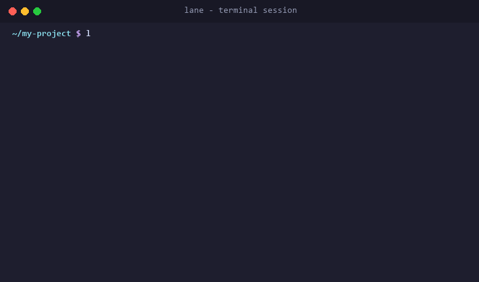

<p>
  <a href="https://github.com/Mrjwj34/lane">
    
  </a>
  <span style="font-size: 1.5em; font-weight: bold; line-height: 1.3;">Fast, low-cost management of parallel development environments</span><br><br>
  <a href="https://github.com/Mrjwj34/lane/actions/workflows/ci.yml"></a>
  <a href="https://github.com/Mrjwj34/lane/releases"></a>
  <a href="https://golang.org"></a>
  <a href="LICENSE"></a>
</p>
<br clear="left" />

<p align="center">
  English | <a href="README.zh-CN.md">简体中文</a>
</p>

lane provisions lightweight, isolated local workspaces for parallel agent programming, combining Git worktrees, private data directories, dynamic port assignment, and supervised processes without virtual machine overhead.

<p align="center">
  
</p>

## Install

Choose any of the following installation methods.

### Download prebuilt binaries

Prebuilt binaries for Linux, macOS, and Windows are available on the GitHub Releases page. Extract the archive and place the executable in your PATH.

### Install with Go

Requires Go 1.25 or newer:

```sh
go install github.com/Mrjwj34/lane/cmd/lane@latest
```

### Build from source

```sh
git clone https://github.com/Mrjwj34/lane.git
cd lane
go build -o bin/lane ./cmd/lane
```

## 30-Second Quick Start

### 1. Initialize lane in your repository

Run initialization in your repository root:

```sh
lane init
lane hook install all
```

This generates a base template, installs the skill definition into agent directories for tools like Claude Code and Cursor, and configures worktree hooks.

### 2. Let your Agent configure lane.yaml

Prompt your coding agent:

> Inspect this repository and configure lane.yaml based on existing startup scripts, toolchains, and listen ports.

The agent reads the embedded skill, inspects project dependencies, and declares required ports and services automatically.

If you prefer to configure manually, see the complete configuration guide and examples in [docs/features.md](docs/features.md).

### 3. Create an isolated workspace and start services

```sh
lane new feature-a --up
```

### 4. Run tests within the workspace context

```sh
lane run -- npm test
```

### 5. Clean up after work is pushed

```sh
lane done feature-a
```

## Why lane Exists

When multiple software agents work on the same repository in parallel, simple branches are not enough. Running concurrent test suites or background servers immediately causes TCP port collisions, database state corruption, and leaked processes.

Developers often face an awkward trade-off. Raw Git worktrees manage file trees but leave ports, databases, and background processes entirely unhandled. Manual port assignment leads to accidental commits of local port overrides. Full container stacks consume excessive memory, introduce filesystem performance penalties on macOS and Windows, and slow down agent feedback loops.

lane solves this by providing a unified workspace abstraction. Each workspace receives its own linked Git checkout, private data directory, atomic port reservations, and process supervision. Operations complete in milliseconds without requiring a persistent background daemon.

## Comparison with Docker, devcontainer, and Git worktree

### Git worktree alone

Git worktree provides isolated branches and checkouts, but offers no assistance with port allocation, database persistence, process supervision, or environment variables. Everything beyond source files must be managed manually.

### Docker and devcontainer

Docker and devcontainer provide complete operating system isolation. However, they come with substantial startup latency, heavy memory footprints, bind mount filesystem slowdowns on non-Linux hosts, and repetitive image rebuild overhead. They treat the entire machine environment as the boundary of isolation.

### lane

lane chooses a pragmatic middle path. In native mode, it runs host processes directly with zero virtualization overhead while isolating ports, data directories, and environment variables. In container mode, it reuses a single Linux container per workspace without per-command rebuilds, forwarding host traffic through loopback gateways. lane treats the workspace rather than the entire operating system as the primary unit of isolation.

## Architecture

lane separates workspace management from the execution context. Each workspace has its own branch configuration, runtime plan, and operation lock.

<div align="center">
  
</div>

Detailed documentation:
- User Guide: [docs/features.md](docs/features.md) covers complete configuration references, practical workflows, and agent integrations.
- Runtime contract: [docs/runtime.md](docs/runtime.md) explains networking, port mapping, and container execution rules.
- Architecture decisions: [docs/architecture.md](docs/architecture.md) details the daemonless lock model, state recovery, and safety invariants.
