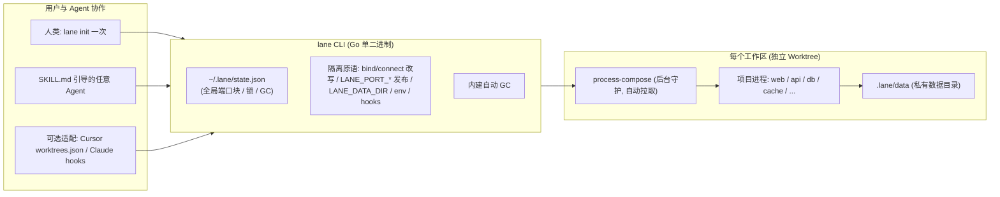

<p align="center">
  <h1 align="center">lane</h1>
  <p align="center">
    <strong>项目无关、Harness 无关的轻量级 Agent 本地多工作区运行工具</strong>
  </p>
  <p align="center">
    
    
    
    
  </p>
</p>

---

## 为什么需要 `lane`？

在本地并发运行多个 AI Coding Agent（如 Cursor、Claude Code、Codex）时，传统的容器与虚拟机方案通常面临以下痛点：

1. **资源开销与冷启动高昂**：macOS Virtualization 内存不完全归还宿主，每个任务分配 VM 会迅速消耗几十 GB 内存；virtiofs 跨层文件 I/O 导致构建和依赖安装以分钟计。
  2. **环境隔离需求明确**：Agent 往往只需要独立的**端口**（避免 `Address already in use`）和独立的**数据库/存储路径**（避免相互踩数据），并非一定要完整的操作系统层隔离。项目写死 `:8080` 时，由 lane 做网络隔离与宿主发布，而不是倒逼项目改读 `PORT`。
3. **脆弱的快照与绑定**：许多方案依赖只读主分支快照或特定 Harness 的专有生命周期，无法跨工具无缝流转。

`lane` 采用 **原生进程 + 端口/数据目录分区** 的极简设计：

> **一个工作区 = 一个 Git Worktree + 一块唯一端口 + 一个私有数据目录 + 一组由项目声明的进程**

---

## 核心特性

- ⚡ **Zero-VM 秒级冷启动**：直接运行宿主机原生进程，无虚拟化损耗，内存占用仅为真实进程大小（通常每个工作区仅几十到数百 MB）。
- 🔌 **组件中立（一切皆进程）**：不绑定任何具体数据库或服务。Postgres、MySQL、Redis、Elasticsearch、SQLite 甚至 Docker 容器，在 `lane` 看来都只是由项目声明的普通进程。
- 🧱 **分层渐进接入**：
  - **L0**：纯 Worktree（零配置，任何 Git 仓库直接运行 `lane new / ls / done`）。
  - **L1**：端口与环境变量派生（`lane.yaml` 声明命名端口或 `listen:` 硬编码端口、`LANE_DATA_DIR` 与 setup 钩子）。
  - **L2**：受管进程（直通 process-compose，后台守护并自动做就绪探测）。
- 🤖 **Agent 优先 & Harness 无关**：
  - 随二进制内嵌开放标准 `SKILL.md`，Agent 读懂后自主完成项目配置与 smoke 自测。
  - 所有查询命令支持稳定 `--json` 输出。
  - 自然兼容 Cursor、Claude Code 内部自建的 worktree，以目录为事实身份，自动清理失效残留。
- 🧹 **内建自动 GC**：
  - 目录已消失自动回收残留端口与进程。
  - 空闲超时（`idle_stop_hours`）自动停机。
  - PR/分支已合并自动移除（`remove_after_days`）。

---

## 架构概览



---

## 配置规范：`lane.yaml`

项目根目录下只需一个轻量级 `lane.yaml`：

```yaml
version: 1
base: main
isolate: net                                 # 改写硬编码监听端口；进程仍在主机网络，可访问公网

# 可选：给已发现的端口起名，供宿主侧 LANE_PORT_* / env 引用
ports:
  web:
    listen: 5173
  api:
    listen: 8080
  pg:
    listen: 5432
  redis:
    listen: 6379

env:
  # 给宿主侧（浏览器、lane open、其他工作区）用的地址
  DATABASE_URL: postgres://localhost:${LANE_PORT_PG}/app
  REDIS_URL: redis://127.0.0.1:${LANE_PORT_REDIS}
  VITE_API_URL: http://127.0.0.1:${LANE_PORT_API}

env_file: .env.local                         # 可选：导出托管块供 Vite 等前端工具读取
copy_dirs: [node_modules]                    # 从主工作树硬链接/clonefile 复用依赖

hooks:
  setup:
    - npm ci
    - initdb -D "$LANE_DATA_DIR/pg" -U app && ./scripts/seed.sh
  teardown: []                               # 销毁前钩子

processes:                                   # process-compose 语法，直通执行；命令保持项目原样
  pg:
    command: postgres -D "$LANE_DATA_DIR/pg" -k "$LANE_DATA_DIR"
    readiness_probe:
      exec:
        command: pg_isready -p 5432
  api:
    command: go run ./cmd/server
    depends_on:
      pg: { condition: process_healthy }
    readiness_probe:
      http_get:
        port: 8080
        path: /healthz
  web:
    command: npm run dev

gc:
  idle_stop_hours: 4                         # 超过 4 小时无活动自动停机进程
  remove_after_days: 7                       # 分支已合并且超过 7 天自动移除
  max_workspaces: 8                          # 超过最大配额时淘汰最旧的干净工作区
```

通用原语是 `isolate: net`：进程留在主机网络上（公网、Docker、DNS 都还能用），lane 只改写回环上的硬编码 `bind`/`connect`，映射到唯一宿主端口。不写 `listen:` 时也会发现并登记这些端口。`listen:` 只用来给宿主端口命名。进程已接受 `--port` / `$PORT` 时，仍可用短写 `ports: [web, api]`（不隔离）。Linux / macOS 用 libc preload（Linux 上 Go 另走 seccomp）。macOS 上签名/SIP 父进程会丢掉 `DYLD_*`，lane 用未签名的 `lane-remap-launch` 在 exec 目标进程前重新注入。Windows 尚未实现。

---

组件配方见 [docs/recipes](./docs/recipes)：Postgres、MySQL、Redis、Elasticsearch、SQLite 与 Docker 都只是普通进程。默认工作区路径为仓库旁的 `<reponame>.lanes/<slug>`，全局状态在 `$LANE_HOME/state.json`（默认 `~/.lane/state.json`）。

## 常用命令一览

| 命令 | 描述 |
| :--- | :--- |
| `lane` | 全局工作区总览（无子命令） |
| `lane init` | 在当前仓库生成带注释的 `lane.yaml` 模板并安装配套 Skill |
| `lane skill install` | 将内嵌的 `SKILL.md` 分发到 `.agents` / `.claude` / `.cursor` 的 `skills/lane/` |
| `lane hook install [harness]` | 安装 Cursor (`worktrees.json`) 或 Claude Code 钩子适配 |
| `lane new <slug> [--up]` | 基于基线分支创建独立 worktree，分配端口块并可选启动进程 |
| `lane attach [slug]` | 打印工作区路径与 `LANE_*` 导出语句 |
| `lane adopt [--setup]` | 将当前目录（Cursor/Claude 已建 worktree）登记为 lane 工作区 |
| `lane ls [--json]` | 列出所有工作区状态、分支、端口分布与进程存活情况 |
| `lane status [--json]` | 查看当前工作区的进程状态与就绪探针信息 |
| `lane ports [--json]` | 查看当前工作区分配的专用端口映射表 |
| `lane up / down` | 启动 / 停止当前工作区的所有后台进程 |
| `lane logs <proc>` | 查看指定受管进程的日志输出 |
| `lane run -- <cmd>` | 在注入了所有 `LANE_*` 变量的环境中运行指定一次性命令（测试/数据迁移） |
| `lane reset` | 停止进程，重置 `$LANE_DATA_DIR` 并重新执行 `hooks.setup` |
| `lane done [slug] [--force]` | 验证代码已提交推送后安全销毁工作区、释放端口与清理分支 |
| `lane gc [--dry-run]` | 扫描并回收残留端口、停机空闲工作区与清理已合并目录 |
| `lane open [port-name]` | 用系统浏览器打开已分配的 HTTP 端口 |
| `lane doctor [--fix]` | 诊断依赖工具链（git / process-compose）与环境健康度 |

---

## 开发与演进路线

- **M1: 核心原语与 MVP 骨架**
  - [x] 仓库骨架搭建、基础 CI、规范制定与远程仓库创建
  - [x] L0 Worktree 生命周期（`new/attach/adopt/ls/done` + `.worktreeinclude`）
  - [x] L1 `lane.yaml` 解析、端口块动态分配、环境变量派生与钩子运行
  - [x] L2 进程直通 process-compose（自动下载钉死版本、就绪探针与状态监控）
  - [x] 内嵌 `SKILL.md` 与 `lane init`
  - [x] 常见组件配方手册（Postgres / MySQL / Redis / ES / SQLite / Docker）
- **M2: 自动化与体验打磨**
  - [x] 完整 GC 策略（空闲停机、已合并清理、最大配额淘汰）
  - [x] `copy_dirs` 秒级依赖复用（硬链接/clonefile 复制 `node_modules` 等）
  - [x] 全局总览面板与 `lane open` 快速打开浏览器
  - [x] Windows 原生（process-compose TCP）与 WSL2（Linux 路径）跨平台处理
- **M3: 开源发布与生态采用**
  - Homebrew Tap / Scoop / `go install` 安装分发
  - 真实重度项目接入切换与端到端回归

---

## 参与贡献

请参阅 [AGENTS.md](./AGENTS.md) 了解详细的开发规范、代码风格要求与提交原则。

```bash
# 本地验证
just check
just test
just build
```

## License

[MIT](./LICENSE)
